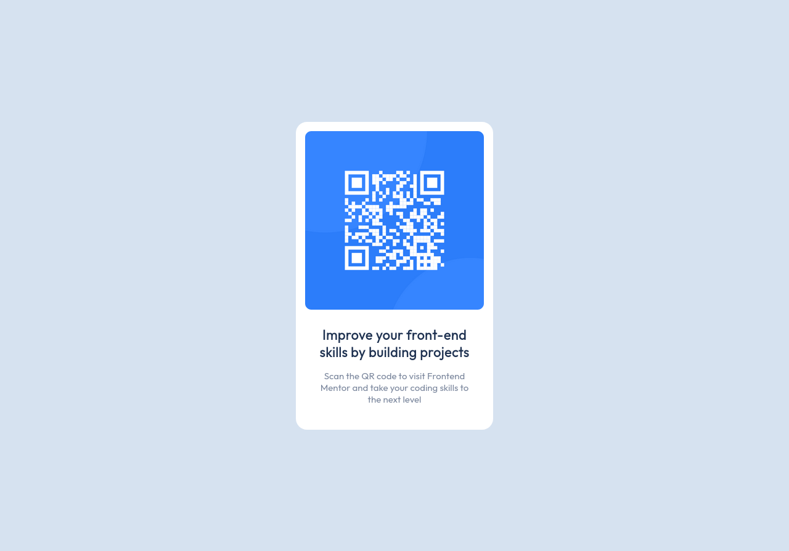

# Frontend Mentor - QR code component solution

This is a solution to the [QR code component challenge on Frontend Mentor](https://www.frontendmentor.io/challenges/qr-code-component-iux_sIO_H). Frontend Mentor challenges help you improve your coding skills by building realistic projects. 

## Table of contents

- [Overview](#overview)
  - [Screenshot](#screenshot)
  - [Links](#links)
  - [What I learned](#what-i-learned)
  - [Continued development](#continued-development)
  - [Useful resources](#useful-resources)
- [Author](#author)

## Overview

### Screenshot

### Links

- Solution URL: https://github.com/ThomasH2001/QR-Code-Component

### What I learned

I learned how to vertically center elements and how to add rounded corners to elements.

### Continued development

I would like to experiment with different ways to vertically center elements and learn more about the mechanics of border-radius.

### Useful resources

- [15 ways to implement vertical alignment with CSS](https://blog.logrocket.com/15-ways-implement-vertical-alignment-css/)
- [border-radius](https://developer.mozilla.org/en-US/docs/Web/CSS/border-radius)

## Author

- Frontend Mentor - [@ThomasH2001](https://www.frontendmentor.io/profile/ThomasH2001)
- Github - [@ThomasH2001](https://github.com/ThomasH2001/)
